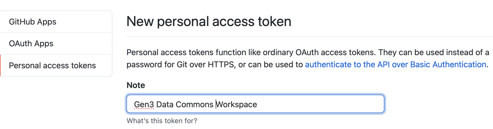

# How to share notebooks from the Gen3 Workspaces
#### Fan Wang      
#### 6/7/2021

## Background
There are a few different options for sharing analysis notebooks from a Gen3 Data Commons Workspace with collaborators outside the Gen3 platform. Integrated Jupyter Notebooks contain code cells to run interactive analysis (in R or Python) and markdown cells to enable detailed documentation of the analyses and data derived. This document summarizes two methods available to share analysis notebooks: 1. How to share a static copy of an “executed” notebook which contains all the generated plots and outputs, 2. How to leverage GitHub for sharing  Jupyter notebooks online to allow for versioning and interactive collaboration.

## Table of Contents
1. Sharing notebooks locally	
2. Sharing notebooks on Gist and Github through the browser	
    * 2.1 Gist	
    * 2.2 GitHub 	
3. Rendering larger notebooks via the nbviewer	
4. Sharing notebooks on GitHub from the Gen3 Workspace	
    * 4.1 Git setup in Gen3 Data Commons Workspace	
    * 4.2 Creating personal access token for authentication to GitHub 
    * 4.3 Sharing notebooks in Github repositories from Workspace	


## 1. Sharing notebooks locally	
It is possible to export to a variety of formats from within the notebook by navigating to **File** -> **Download As**. Be sure to export the notebook as a Jupyter Interactive Notebook (`*.ipynb` file format) to enable someone else to interact with the notebook.


The exported Jupyter Notebook will be saved in the default download location on the local computer being used.

## 2. Sharing notebooks on Gist and Github through the browser 	

### 2.1 Gist
Once the Jupyter Notebook is saved to the local computer, the easiest way to share a Jupyter Notebook is to use Gist, which is a quick sharing service provided by Github based on copy-paste.

Navigate to https://gist.github.com/. There will be a text area displayed for copy-pasting content. Drag the `*.ipynb` file from the File Manager into the text-area and it will paste it’s content into the area, then click on the **Create a public gist** button and it will be uploaded and rendered automatically. Multiple notebooks can be saved to the same gist.
To prevent the gist from being findable on public search engines and to prevent the gist  from appearing under gist.github.com/yourusername, select **Create a private gist** instead. 


The good thing is that there is an actual git repository behind this interface, it can later be cloned and updated using git, or a newer version of the notebook can be copy-pasted using the web interface.

Please note if  the  error messages are displayed, **"Sorry, something went wrong. Reload?"** when viewing an `*.ipynb` on a Gist blob page, try clicking on the **reload** button to re-render the notebook. If the issue persists, a workaround is to open that notebook using nbviewer online  discussed in detail in the section “Render larger notebooks via nbviewer”.


### 2.2 GitHub
If the Jupyter Notebook is available on a local computer, the notebook can be shared by dropping the Jupyter notebook (`*.ipynb`) file in a GitHub repository. It will be rendered directly in the browser. This method works for both public and private repositories.


## 3. Render larger notebooks via nbviewer	
The Github and Gist rendering engine may not always be reliable: it may fail for larger notebooks, it may not show notebooks on mobile, or it may not support some JavaScript based libraries. 

For these cases, it is recommended to use the `nbviewer`, which is the Jupyter Notebook viewer service hosted by Jupyter. Navigate to their website on https://nbviewer.jupyter.org/,  paste the full notebook URL from Github or Gist, and the nbviewer will render the notebook automatically.

Please note if a rendered notebook in nbviewer appears different from a rendered notebook in Github, then append `?flush_cache=true` to the end of the nbviewer version url to force it to re-render. Please also note that the nbviewer only renders the inputs and outputs of the notebook. The code in the link is not executable.


## 4. Sharing notebooks on GitHub from the Gen3 Workspace  
Git is the version control system (VCS) available for use with the Gen3 Data Commons Workspaces. In this section, sharing a notebook directly from a Gen3 Data Commons to GitHub is described in detail. 

### 4.1 Git setup in Gen3 Data Commons Workspace	
First, set up a username and email address. This is important because every Git commit uses this information, and it’s immutably locked into the commits that are created. Git comes with a tool called `git config` that obtains and sets configuration variables that control all aspects of how Git looks and operates.

To set a user name and email address, first open the **Terminal** from the **Launcher page** in Workspace, then type:
```
$ git config --global user.name your_github_username
$ git config --global user.email your_email_linked_to_github
```

Please note that these settings only need to be performed once in the user's workspace. By passing the `--global` option, Git will always use that information for anything done in that Workspace. To view all of your current settings, run the following code:
```
$ git config --list --show-origin
```


The config file will be saved in `/home/jovyan/.gitconfig`. In order to override the config settings with a different name or email address for specific projects, run the `git config user.name` and `git config user.email` commands without the `--global` option.

### 4.2 Creating personal access token for authentication to GitHub

Create a personal access token to use in place of a password with the command line or with the API.

Personal access tokens (PATs) are an alternative to using passwords for authentication to GitHub when using the GitHub API or the command line.

1. [Verify the email address](https://docs.github.com/en/github/getting-started-with-github/signing-up-for-github/verifying-your-email-address), if it hasn't been verified yet.

2. Login on github.com. In the upper-right corner of any page, click on the profile photo, then click **Settings**.

    

3. In the left sidebar, click **Developer settings**.

    

4. In the left sidebar, click **Personal access tokens**.

    

5. Click **Generate new token**.

    

6. Give the token a descriptive name.

    

7. Select the scopes or permissions to grant this token. To use the token to access repositories from the command line, select repo.

     

8. Click **Generate token**.

     

Once a token is generated, it can be used instead of a password when performing Git operations over HTTPS. For example, on the command line enter the following:

```
$ git clone https://github.com/username/repo.git
Username: your_username
Password: your_token
```

Personal access tokens can only be used for HTTPS Git operations. If the repository uses an SSH remote URL, you will need to switch the remote from SSH to HTTPS.

### 4.3 Sharing notebooks in Github repositories from Workspace
Finally, share the Jupyter Notebook in GitHub repositories by following the steps below:

1. Open the **Terminal** from the **Launcher** page.


2. Create the feature branch with a name that describes the work the branch contains, and then switch to the new branch using the following commands, replacing `feature_id` with the name of the feature branch.
```
$ git checkout -b [feature_id]
```
3. Perform your development work on the branch just created (for example, copy the notebook in Workspace to the code repository).
```
$ cp ../notebook.ipynb . 
```
4. Commit branch changes back to the code repository.
```
$ git commit -a -m "Comment"
```
5. Push branch changes to the code repository (where `feature_id` is the name of the feature branch).
```
$ git pull origin [feature_id]
$ git push origin [feature_id]
```
6. Create pull requests and merge pull requests in GitHub.
7. Now the notebook from the Gen3 Workspace is available in Github.

